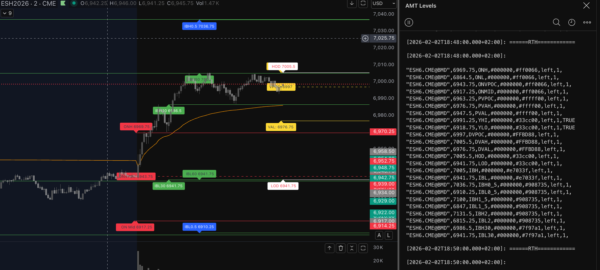

# Auction Market Theory Indicator

TradingView Pine Script v6 indicator that plots Auction Market Theory (AMT) session levels for RTH/ETH, including value area, VPOC, initial balance extensions, and session VWAP, with Bookmap cloud notes logging.

## Features

- RTH and ETH session detection with configurable session times.
- RTH levels: HOD/LOD, IB30, IB60, IB0.5, IB1.5, IB2.
- Value Area (VAH/VAL) and VPOC computed from a session volume profile histogram.
- ETH levels: ONH/ONL/ONMID/ONVPOC.
- Session VWAP overlay.
- Optional labels and/or lines, with ability to extend lines to the right.
- Previous session level carry-forward.
- Bookmap CSV-style logging and alert payload formatting.

## Inputs

- Sessions: `RTH session time`, `ETH session time`.
- Levels toggles: `Show HOD and LOD`, `Show IB`, `Show IB30`, `Show IB60`, `Show IB1.5`, `Show IB2`, `Show ONH, ONL, ONVPOC, ONMID`, `Show VAH and VAL`, `Show VPOC`.
- Value Area: `Value Area %`, `Number of Histograms`.
- Display: `Show price labels`, `Show Lines at price levels`, `Extend lines to the right`, `Session VWAP`, `VWAP color`.
- Lookback: `Look back time in hours for previous sessions`.
- Logging: `Symbol Prefix` for Bookmap datafeed output.

## Getting started

1. Open TradingView and create a new Pine Script.
2. Paste the contents of [src/auction-market-theory.pine](src/auction-market-theory.pine).
3. Save and add the indicator to a chart.

## Notes

- The indicator is designed to run on intraday timeframes with session boundaries.
- VPOC/VAH/VAL are calculated from a volume profile histogram built from session bars.
- Alerts emit a CSV-style payload containing AMT levels for Bookmap.

## Bookmap Cloud Notes output

The script logs and alerts a CSV-style line compatible with Bookmap Cloud Notes. Each line follows this format:

"SYMBOL",PRICE,NOTE,FG_COLOR,BG_COLOR,ALIGN,DIAMETER,LINE

Example (from the script):

"ESH6.CME@BMD",5243.25,ONVPOC,#000000,#ff0066,left,1,TRUE

`LINE` is `TRUE` when the note should draw a horizontal line in Bookmap; otherwise it is empty.

## Alerts → email → local Bookmap Cloud Notes

TradingView alerts can be configured to send these CSV lines to your email address. A simple Python script can then read the email and publish the notes locally to Bookmap Cloud Notes.

Suggested flow:

1. Create a TradingView alert for this indicator.
2. Use the alert message template to output the payload (the script already builds the message in `msg`).
3. Configure the alert to send to your email.
4. Run a local Python reader that parses the incoming email and forwards the CSV lines to your Bookmap Cloud Notes endpoint.

## Structure

- [src/auction-market-theory.pine](src/auction-market-theory.pine) — indicator source.

